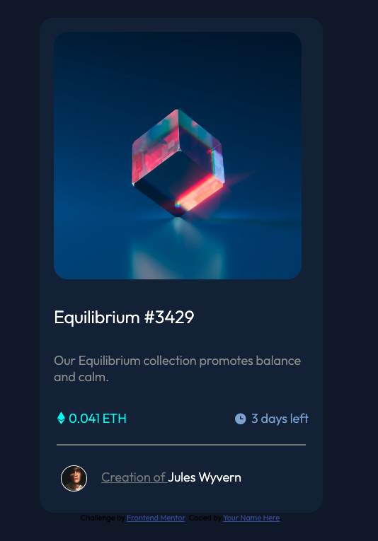

# NFT preview card component solution

This is a solution to the [NFT preview card component challenge on Frontend Mentor](https://www.frontendmentor.io/challenges/nft-preview-card-component-SbdUL_w0U). Frontend Mentor challenges help you improve your coding skills by building realistic projects. 

## Table of contents

- [Overview](#overview)
  - [The challenge](#the-challenge)
  - [Screenshot](#screenshot)
  - [Links](#links)
- [My process](#my-process)
  - [Built with](#built-with)
  - [What I learned](#what-i-learned)
  - [Continued development](#continued-development)
  - [Useful resources](#useful-resources)
- [Author](#author)
- [Acknowledgments](#acknowledgments)

## Overview
    Our Equilibrium collection promotes balance and calm.

### The challenge

Users should be able to:

- View the optimal layout depending on their device's screen size
- See hover states for interactive elements

### Screenshot



### Links

- Solution URL: [Click here for Source code](https://github.com/UbaidRussell/NFT-preview-card-component)
- Live Site URL: [Click here for live site](https://ubaidrussell.com/NFT-preview-card-component/)

## My process
Mapped out the site and then started coding.

### Built with

- Semantic HTML5 markup
- CSS custom properties
- Flexbox
- Mobile-first workflow

### What I learned

This code I found interesting because it creates the image overlay on hover and doing that sparked my interest in learning more about CSS animations.

```css
.image-overlay{
    position: absolute;
    top: 0;
    left: 0;
    width: 90%;
    height:350px;
    margin: 20px;
    border-radius: 20px;
    background-color: hsla(215, 51%, 70%,0.6);
    opacity: 0;
    transition: opacity 0.25s ease;
}
.image-overlay:hover{
    opacity: 1;
}
.view-icon{
    position: absolute;
    top: 50%;
    left: 50%;
    transform: translate(-50%, -50%);
    color: white;
    font-size: 50px;
    cursor: pointer;
}
```

### Continued development
We're going to just keep building on top of this.

### Useful resources

- [How to have images in line with text in css](https://stackoverflow.com/questions/20402261/how-to-have-images-in-line-with-text-in-css) - This helped me for aligning images with text. I really liked this pattern and will use it going forward.

- [How to Create a Horizontal Line in HTML](https://www.wikihow.com/Insert-a-Line-in-HTML) - This is an amazing article which helped me finally understand how to insert a line in HTML. I'd recommend it to anyone still learning this concept. What I like about it is that it is very simple, easy to understand and you can implement it straight into HTML code.

- [Image Hover Text Overlay Effect with HTML & CSS - Web Design Tutorial](https://www.youtube.com/watch?v=exb2ab72Xhs) This Youtube video helped us with the image overlay effect. I really liked this pattern and will use it going forward.

## Author

- Website - [Ubaid Russell](https://ubaidrussell.com/)
- Frontend Mentor - [@ubaidrussell](https://www.frontendmentor.io/profile/ubaidrussell)
- Twitter - [@UbaidRussell](https://www.twitter.com/ubaidrussell)


## Acknowledgments
Shout out to the Frontend Mentor community for being so helpful and supportive.
